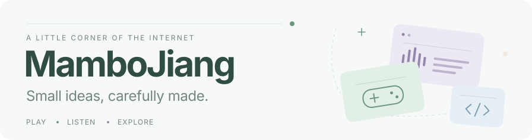
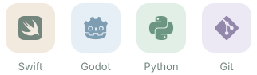

<picture>
  <source media="(prefers-color-scheme: dark)" srcset="assets/header-dark.svg">
  
</picture>

<table>
  <tr>
    <td width="66%" valign="top">
      01 &nbsp; / &nbsp; A LITTLE ABOUT ME
      <h3>Hi, I'm Mambo.</h3>
      
I'm a developer making <b>small games, music tools, and web experiments</b>.

      
I enjoy exploring ideas through code and polishing the little details along the way.

    </td>
    <td width="34%" valign="top">
      ELSEWHERE
        
      <a href="https://mambojiang.site">
        <picture>
          <source media="(prefers-color-scheme: dark)" srcset="assets/website-dark.svg">
          
        </picture>
      </a>
        
      <a href="https://mambojiang.itch.io">
        <picture>
          <source media="(prefers-color-scheme: dark)" srcset="assets/itch-dark.svg">
          
        </picture>
      </a>
    </td>
  </tr>
</table>

 

02 &nbsp; / &nbsp; SELECTED WORK

<table>
  <tr>
    <td width="50%" valign="top">
      <a href="https://github.com/MamboJiang/VerseLoom">
        <picture>
          <source media="(prefers-color-scheme: dark)" srcset="assets/verseloom-dark.svg">
          
        </picture>
      </a>
      <h3><a href="https://github.com/MamboJiang/VerseLoom">VerseLoom</a></h3>
      
A native bilingual lyrics companion for Music on macOS and iPad.

      SWIFTUI &nbsp; · &nbsp; MUSIC TOOLS
    </td>
    <td width="50%" valign="top">
      <a href="https://mambojiang.itch.io/livelykitchen">
        <picture>
          <source media="(prefers-color-scheme: dark)" srcset="assets/livelykitchen-dark.svg">
          
        </picture>
      </a>
      <h3><a href="https://mambojiang.itch.io/livelykitchen">LivelyKitchen</a></h3>
      
A chaotic two-player kitchen battler, made for the 2025 CiGA GameJam.

      GODOT &nbsp; · &nbsp; <a href="https://github.com/MamboJiang/LivelyKitchen">SOURCE CODE</a>
    </td>
  </tr>
</table>

 

03 &nbsp; / &nbsp; TOOLS I REACH FOR

  <picture>
    <source media="(prefers-color-scheme: dark)" srcset="assets/tools-dark.svg">
    
  </picture>

 

04 &nbsp; / &nbsp; A LITTLE ACTIVITY

  <a href="https://github.com/MamboJiang?tab=repositories">
    <picture>
      <source media="(prefers-color-scheme: dark)" srcset="https://github-stats-extended.vercel.app/api?username=MamboJiang&amp;show_icons=true&amp;hide_rank=true&amp;hide=contribs,issues&amp;hide_border=true&amp;card_width=440&amp;bg_color=172824&amp;title_color=A8CDBB&amp;text_color=C5D5CF&amp;icon_color=A8CDBB&amp;border_radius=14&amp;disable_animations=true">
      
    </picture>
  </a>
  <a href="https://github.com/MamboJiang?tab=repositories">
    <picture>
      <source media="(prefers-color-scheme: dark)" srcset="https://github-stats-extended.vercel.app/api/top-langs/?username=MamboJiang&amp;layout=compact&amp;langs_count=4&amp;hide_border=true&amp;card_width=440&amp;bg_color=232533&amp;title_color=C2BDDC&amp;text_color=CACBDD&amp;border_radius=14&amp;disable_animations=true">
      
    </picture>
  </a>

<!-- A future blog section can be added here. -->

 

  Thanks for stopping by.
    
  

